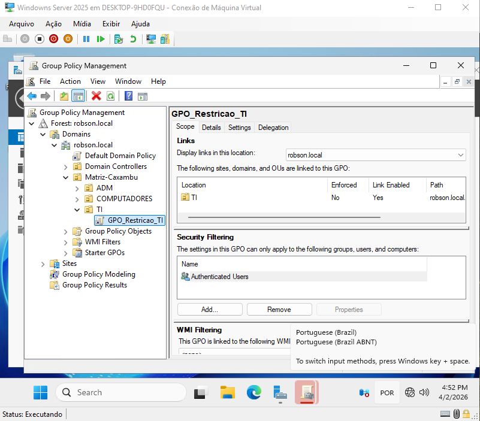
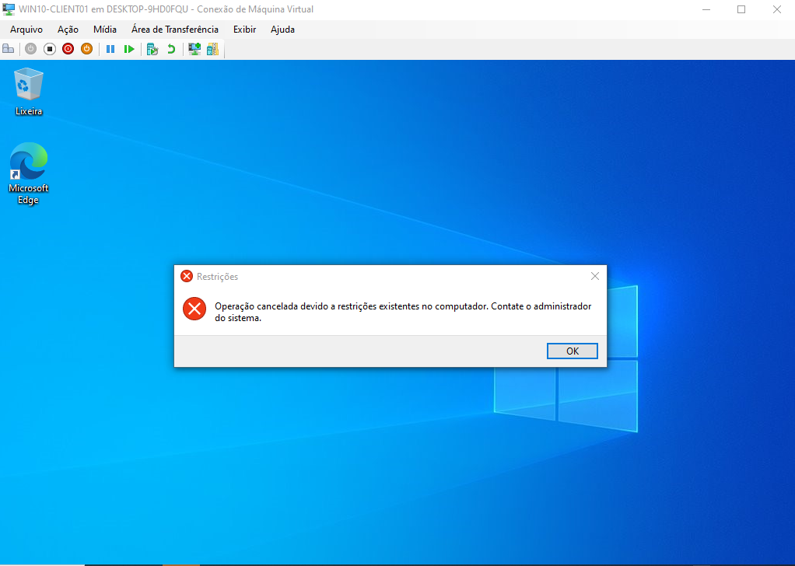
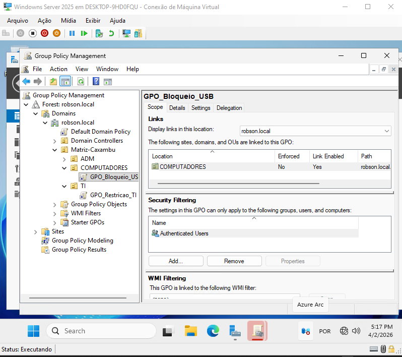
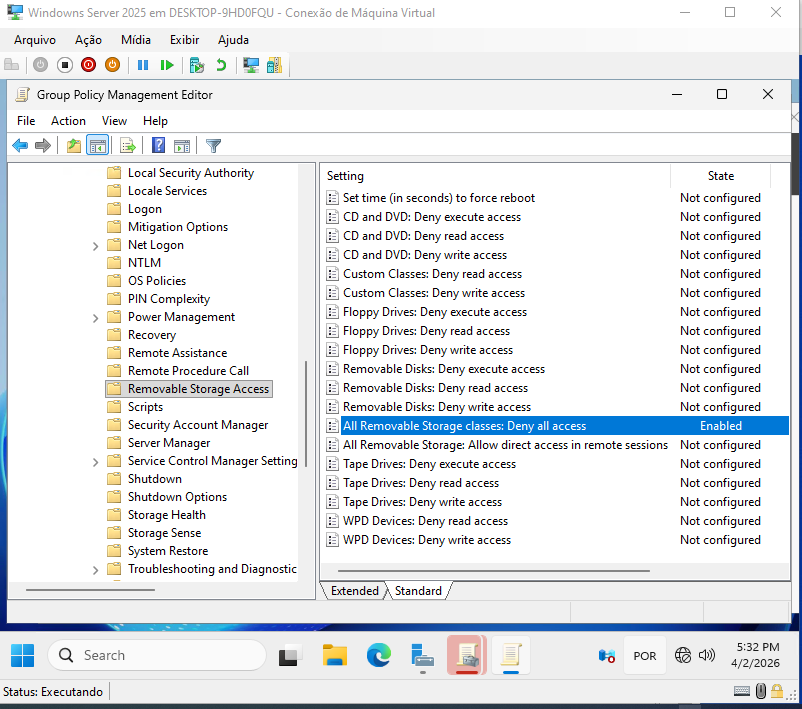
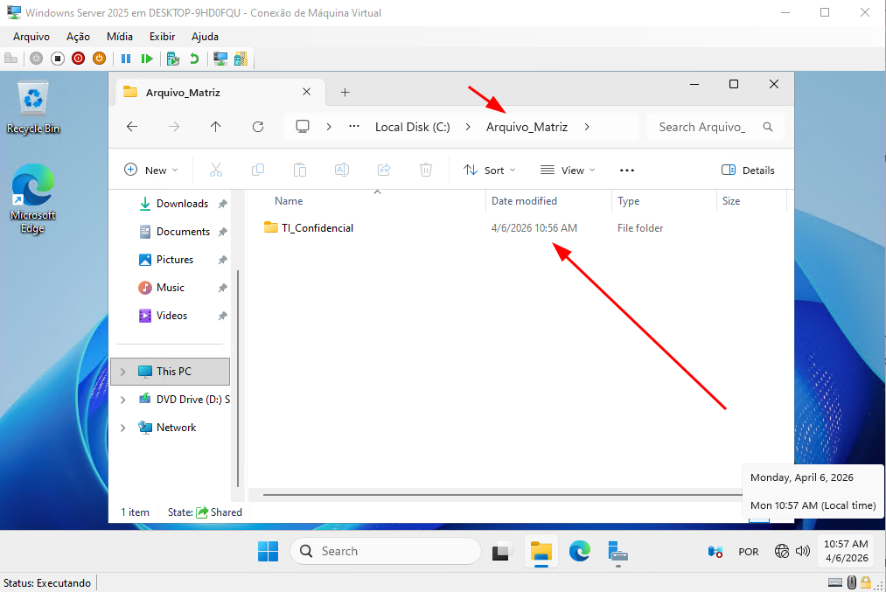

Este repositório documenta a implementação de um ambiente de rede corporativa utilizando **Windows Server 2025**, focado na gestão centralizada de identidades e segurança.

##  Objetivo do Projeto
Estabelecer uma fundação sólida de diretório (Active Directory) que permita escalabilidade, automação de políticas e controle rígido de acessos (RBAC - Role-Based Access Control).

##  Implementação Técnica

### 1. Estruturação de Unidades Organizacionais (OUs)
Implementei uma hierarquia de OUs personalizada para fugir dos containers padrão do Windows, permitindo a aplicação futura de **GPOs (Group Policy Objects)** de forma granular.

* **Matriz-Caxambu (Raiz)**: Unidade principal da organização.
* **ADM / TI**: Segmentação por departamentos para aplicação de políticas distintas.
* **COMPUTADORES**: Destinado ao gerenciamento de ativos de hardware e Hardening de estações de trabalho.

>**Evidência:** 
> **Evidência:** 

### 2. Gestão de Grupos e Segurança (Metodologia AGDLP)
Adotei a estratégia de **Grupos de Segurança Globais** para organizar usuários por função, preparando o ambiente para o padrão AGDLP.

* **Grupo Criado**: `G_TI_AcessoFull` (Escopo: Global).
* **Ação**: O usuário `robson.silva` foi movido para a OU correspondente e vinculado ao grupo de acesso, garantindo que suas permissões sejam gerenciadas via grupo e não de forma individual.

> **Evidência:** 
> **Evidência:** 

###  Implementação de Políticas de Grupo (GPO) - Hardening
Para elevar o nível de segurança e padronização das estações de trabalho, implementei a primeira política de restrição no domínio.

* **Política:** Bloqueio de acesso ao Painel de Controle e Configurações do Sistema.
* **Escopo:** Aplicada especificamente à OU `TI` para fins de homologação.
* **Objetivo:** Impedir que usuários finais realizem alterações críticas no sistema operacional, reduzindo o número de chamados por desconfiguração e aumentando a integridade do ambiente.
* **Validação:** Após a execução do comando `gpupdate /force` na estação cliente, a restrição foi aplicada com sucesso, bloqueando tentativas de acesso administrativo por parte do usuário comum.

> **Evidência:** 
> **Evidência:** 
> **Evidência:** 
> **Evidência:** 

###  Bloqueio de Dispositivos Removíveis (USB)
Para mitigar riscos de vazamento de dados (DLP) e infecções por malware, apliquei uma política de nível de máquina para o bloqueio de armazenamento externo.

* **Política:** *All Removable Storage classes: Deny all access* (Bloqueio total de portas USB para armazenamento).
* **Escopo:** Aplicada à OU `COMPUTADORES`. O objeto *Computer* da estação Windows 10 foi movido do container padrão para a OU correspondente para receber a diretiva.
* **Objetivo:** Garantir que a restrição de hardware seja aplicada fisicamente à estação de trabalho, independentemente do nível de privilégio do usuário que realizar o logon.

> **Evidência:** 
> **Evidência:** 
> **Evidência:** 

###  Servidor de Arquivos (File Server) e Segurança NTFS
Para garantir a confidencialidade e integridade dos dados da empresa, implementei um Servidor de Arquivos utilizando a metodologia de acesso de menor privilégio.

* **Arquitetura de Permissões:** Utilização do modelo de "Duas Portas". Acesso amplo na camada de Compartilhamento (Share) e restrição granular na camada de Segurança (NTFS).
* **Quebra de Herança:** A herança de diretórios foi desabilitada para garantir que pastas departamentais tenham controle de acesso exclusivo.
* **Aplicação do AGDLP na Prática:** O acesso não é dado ao usuário, mas sim ao grupo de segurança. A pasta `TI_Confidencial` foi restrita para aceitar modificações apenas do grupo global `G_TI_AcessoFull`.

> **Evidência:** 
> **Evidência:** )
> **Evidência:** 
> **Evidência:** 
> **Evidência:** 

## 🚀 Próximos Passos
- [x] Implementação de GPOs de segurança (Bloqueio de USB e Painel de Controle).
- [x] Configuração de Servidor de Arquivos (File Server) com permissões NTFS.
- [ ] Automação de criação de usuários via PowerShell.

